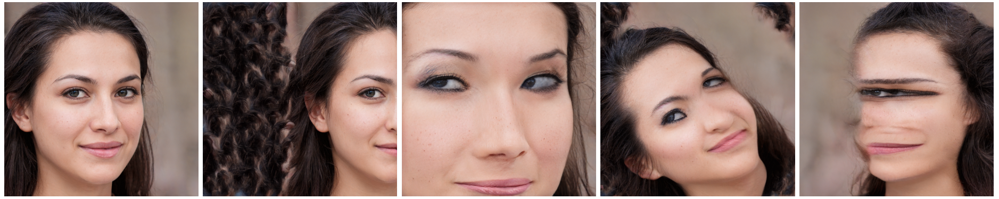

# Network Bending



**Network Bending: Manipulating The Inner Representations of Deep Generative Models**

Terence Broad, Frederic Fol Leymarie, Mick Grierson

Paper: https://arxiv.org/abs/2005.12420

Video: https://youtu.be/IlSMQ2RRTh8

Abstract: *We introduce a new framework for interacting with and manipulating deep generative models that we call *network bending*. We present a comprehensive set of deterministic transformations that can be inserted as distinct layers into the computational graph of a trained generative neural network and applied during inference. In addition, we present a novel algorithm for clustering features based on their spatial activation maps. This allows features to be grouped together based on spatial similarity in an unsupervised fashion. This results in the meaningful manipulation of sets of features that correspond to the generation of a broad array of semantically significant aspects of the generated images. We demonstrate these transformations on the official pre-trained StyleGAN2 model trained on the FFHQ dataset. In doing so, we lay the groundwork for future interactive multimedia systems where the inner representation of deep generative models are manipulated for greater creative expression, whilst also increasing our understanding of how such "black-box systems'' can be more meaningfully interpreted.*

## Examples
Using our unsupervised clustering algorithm for finding sets of features based on the spatial similarity of their activation maps, sets of features emerge for semantic objects that can be manipulated in multiple different ways. Such as cluster `2` in layer `5`, controls a set of features that responsible for the generation of eyes:


Where you can see on the left is the original image, followed by the features being ablated, followed by them being scaled by a factor of 0.5, followed by them being dilated by a kernel radius 2.

In other layers sets of feautures are responsible for the generation of other kinds of properties of the image.


Such as the spatial formation of the face, the highlights on facial regions, the generation of textures or the contrast of colours in the image. 

Transformations can also been chained together to produce distinctive and unusual results:


## Requirements
* Linux (tested on Ubuntu 18.04)
* PyTorch 1.5.0
* CUDA 10.1 or CUDA 10.2
* OpenCV - Refer to [this dockerfile](https://github.com/pytorch/extension-script/blob/master/Dockerfile) for installation of correct version
* Libtorch 1.5 (pre-C++11) [download here](https://pytorch.org/get-started/locally/)
* PyYAML

## Build custom torchscript operators

We have built a number of torchscript operators using OpenCV and libtorch, you will have to have downloaded libtorch and installed the correct version of OpenCV for this to work. See requirements above or [refer to the tutorial for writing your own torchscript operators](https://pytorch.org/tutorials/advanced/torch_script_custom_ops.html) for me details.

  

To build the custom operators you can use the bash script accompanying with the path the your downloaded and unzipped libtorch code

  

> chmod +x ./build_custom_transforms.sh

  

> ./build_custom_transforms.sh /path/to/libtorch

  

If you are having issues with this you can link to the libtorch source in your Pytorch package installation folder: https://discuss.pytorch.org/t/segmentation-fault-when-loading-custom-operator/53301/8?u=tbroad

  

## Download StyleGAN2 Model

You can download the official StyleGAN2 FFHQ 1024 model converted to PyTorch format here: https://drive.google.com/drive/u/0/folders/1kxzAxJ9jrU6z9CPBJ8I87dXy-NJFG4zs

Or refer to the [StyleGAN2 pytorch implementation](https://github.com/rosinality/stylegan2-pytorch) that this code is based on for training your own models, or converting models from the tensorflow format into PyTorch compatible format.

## Generate images

  

You can either generate images from random latents:

  

> python generate.py --ckpt /path/to/model.pt --size 1024 --pics 10 --config/example_transform_config.yaml

  

Or from a latent vector that you have projected into styleGAN space:
numerical
  

If you are using layers with random parameters you can generate multiple different samples from the same latent:

  

> python generate.py --ckpt /path/to/model.pt --size 1024 --pics 100 --latent /path/to/latent.pt --config config/example_transform_config.yaml

## Configuring the Transforms
 The API for defining transforms is a list of transform dictionaries that we provide as a yaml file which will look something like this:
 ```
transforms:
- layer: 4
  transform: "translate"
  params: [0.25, 0.0]
  features: "all"
  feature-param: 
- layer: 5
  transform: "ablate"
  params: []
  features: "cluster"
  feature-param: 2
- layer: 12
  transform: "binary-thresh"
  params: [0.5]
  features: "random"
  feature-param: 0.5
 ```
We have a list that must be called `transforms` then any number of transforms can be defined.

Each transform dict has 5 fields. The first is `layer` that defines which layer you want to apply the transform to [between 1-16].

The second and third are `features` and `features-param` that define which set of convolutional features you want to apply the transform too. There are three modes for this `features:"all"` will apply the transform to all the features in the layer, for this you can leave `feature-param` blank. The second is `features:"random"` which apply the transform to a random selection of features, for this `feature-param` should be a float between 0-1, which defines the proportion of features that the transform will be applied too. The third is `features:"cluster"` which applies transformation to groups of features based on the precalculated set of clusters that get loaded in the cluster dictionary. This should be an integer and can vary depending on the layer (see Table 1 in the paper for the number of clusters in each layer) or the cluster dictionary used (you can calculate you own clusters with an arbitrary amout for each layer).

The fourth and fifth are `transform` and `params`. For transform you pass it a string to define which transform layer you want to insert, and params is a list with either 0, 1 or 2 numerical parameters. A breakdown of all transforms and parameter types are listed below:
```

  transform: "translate", params: [float (x), float (y)], range (-1 to 1)
  transform: "scale", params: [float], range (0, inf)
  transform: "rotate", params: [float], range (0,360)
  transform: "erode", params: [int], range(1 -) 
  transform: "dilate", params: [int], range(1 -)
  transform: "scalar-multiply", params: [float], range(-inf, inf)
  transform: "binary-tresh", params: [float], range(-1,1)
  transform: "flip-h", params: []
  transform: "flip-v", params: []
  transform: "invert", params: []
  transform: "ablate", params: []
```

## Project images to latent space

  
> python projector.py --ckpt [CHECKPOINT] --size [GENERATOR_OUTPUT_SIZE] IMAGE1 ...

## Additional resources

Examples of layer wide transformations being applied to every layer: https://drive.google.com/open?id=1hC9qSw57g2QZ3IggCWEa8BUoY7TcYFfR

Examples of various transformations applied to different clusters: https://drive.google.com/open?id=1oaNco1L1lu7gGgWKNMGqA_vFUFIOVmVx

Trained ShuffleNet CNN models used for clustering: https://drive.google.com/open?id=176GlteP_C3z-EvZDm69uJC8fziwrQOBw

Training and test set used to train CNN classifiers used for clustering: https://drive.google.com/open?id=1F3TOkR8Cu2EOgalXSc1kEpjHwxd_CCbo

## Acknowledgements

This codebased is built upon on this excellent [StyleGAN2 pytorch implementation](https://github.com/rosinality/stylegan2-pytorch) by rosinality.

Model details and custom CUDA kernel codes are from official repostiories: https://github.com/NVlabs/stylegan2

Codes for Learned Perceptual Image Patch Similarity, LPIPS came from https://github.com/richzhang/PerceptualSimilarity

To match FID scores more closely to tensorflow official implementations, I have used FID Inception V3 implementations in https://github.com/mseitzer/pytorch-fid
